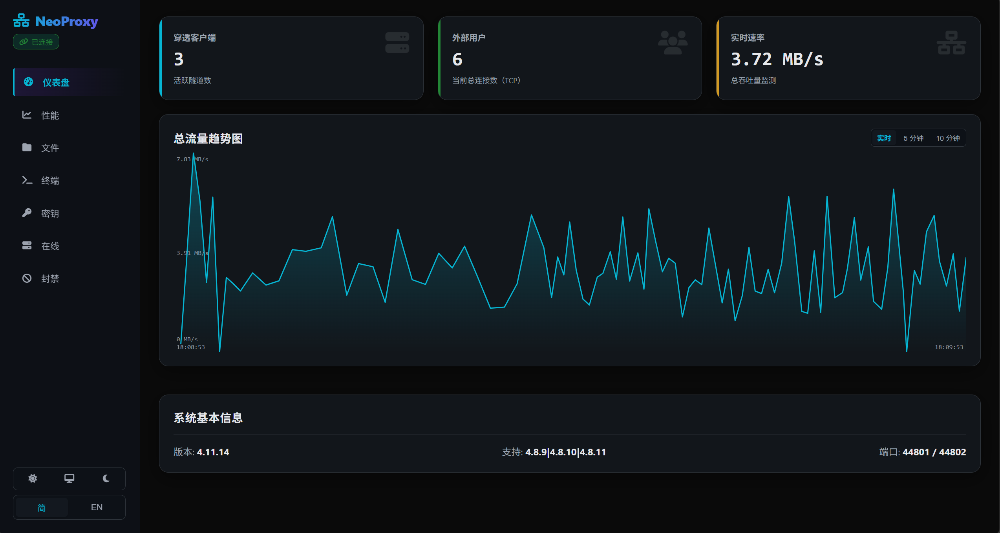

# 🌐 NeoProxyServer – 高性能内网穿透服务端

> 💡 **NeoProxyServer** 是一个基于 Java 21 构建的现代化、高性能、支持流量控制与动态端口分配的内网穿透服务端，适用于开发者、运维人员及个人用户快速暴露本地服务至公网。
---

[](#许可证)


---


## 📦 特性亮点

- ✅ **Java 21 + Maven 构建**，现代 Java 特性加持
- 🔐 **AES 加密通信**，保障数据安全
- 📊 **流量配额控制**（MiB 级别），防止滥用
- ⏳ **密钥有效期管理**，自动清理过期授权
- 🎛️ **动态端口范围分配**（如 `3344-3350`）或固定端口
- 🧠 **智能速率限制**（Mbps 级）
- 📝 **交互式控制台**，支持中文/英文双语
- 📁 **H2 嵌入式数据库**，无需额外依赖
- 🛑 **IP 封禁机制**，增强安全性
- 🌐 **IPv4/IPv6 双栈支持**，完整的地理位置查询功能
- 🖥️ **Windows Terminal / Linux / macOS 全兼容**
- 🌐 **网页内容拦截**，可自定义拦截消息
- 📊 **实时流量监控**，定期通知剩余流量
- 📋 **表格化显示**，直观展示客户端和密钥信息
- 🌐 **Web 管理界面**，支持实时监控、文件管理和系统控制（临时+永久 token 自选）
- 🔄 **虚拟线程支持**，优化并发性能
- 📈 **实时日志流**，通过 WebSocket 实时推送日志到 Web 界面

---

## 🚀 快速开始

### 环境要求

- Java 21+
- Maven（用于构建）
- 必须：需要配合 [NeoLink](https://github.com/NeoLinkProxy/NeoLink) 客户端使用
- 必须（除非本地测试）：公网 IP 或域名（用于外网访问）

### 构建项目

```bash
git clone https://github.com/CeroxeAnivie/PlethoraAPI
mvn install

git clone https://github.com/CeroxeAnivie/NeoProxyServer.git
cd NeoProxyServer
mvn clean package
```

生成的可执行 JAR 文件位于 `target/NeoProxyServer-XXXX.jar`。

### 启动服务端（指定中文）

```bash
java -jar target/NeoProxyServer-XXXX.jar --zh-cn

# 可选参数追加到后面
# --debug                            打印调试信息（异常栈）
# --en-us / --zh-cn                  强制指定语言
```

> 默认监听：
> - **Hook 端口**：`44801`（客户端注册）
> - **连接端口**：`44802`（数据通道）
> - **Web管理端口**：`44803`（Web管理界面，使用 WebSocket 技术）

启动后，服务端将自动生成 `config.cfg` 配置文件和 `sk.mv.db` 数据库。

---

## 🔧 配置说明 (`config.cfg`)

```ini
LOCAL_DOMAIN_NAME=localhost          # 建议替换为你的公网IP或域名
ALERT=true                           # 是否启用详细连接日志
ENABLE_BAN=true                      # 是否启用IP封禁
SO_TIMEOUT=5000                      # 服务端等待客户端响应超时（毫秒）
TELL_BALANCE_MIB=10                  # 每消耗10MB流量通知剩余量
HOST_HOOK_PORT=44801                 # 客户端注册端口
HOST_CONNECT_PORT=44802              # 数据通道端口
WEB_ADMIN_PORT=44803                 # Web管理界面端口
BUFFER_LEN=4096                      # 数据缓冲区大小
SAVE_DELAY=3000                      # 密钥状态保存间隔（毫秒）
AES_KEY_SIZE=128                     # 加密密钥长度
HEARTBEAT_TIMEOUT=5000               # 心跳超时时间（毫秒）
CUSTOM_BLOCKING_MESSAGE=如有疑问，请联系您的系统管理员。  # 自定义网页拦截消息
WEB_ADMIN_TOKEN=                     # 永久Web管理Token（留空则不启用）
```

> 修改后重启生效。Web管理端口变更后会自动重启Web服务。

---

## 📋 控制台命令

NeoProxyServer 提供了丰富的控制台命令来管理服务端。主要命令类别包括：

- 🔔 **日志控制** - `alert`, `debug`
- 🚫 **IP管理** - `ban`, `unban`, `find`, `listbans`
- 📊 **客户端管理** - `list`
- 🔑 **密钥管理** - `key add/set/del/enable/disable/list/lp`
- 🌐 **网页权限** - `web`
- ℹ️ **信息查询** - `ver`

📖 **详细命令文档请查看我们的 [GitHub Wiki](https://github.com/CeroxeAnivie/NeoProxyServer/wiki/%E5%91%BD%E4%BB%A4%E8%AF%A6%E8%A7%A3)**

---

## 🌍 IP 地理位置查询

NeoProxyServer 提供完整的 IP 地理位置查询功能，支持 IPv4 和 IPv6：

- **双栈支持**：同时支持 IPv4 和 IPv6 地址的地理位置查询
- **多源数据**：使用 ip2region 数据库，支持 5 段式和 4 段式数据格式
- **智能解析**：自动识别内网 IP，并提供更精确的外网 IP 地理位置信息
- **自动加载**：启动时自动加载 IP 地理位置数据库，支持热更新

IP 地理位置信息会在客户端连接时显示，并可通过 `list` 命令或 Web 管理界面查看所有活跃客户端的地理位置信息。

---

## 📊 流量控制

NeoProxyServer 提供精细的流量控制功能：

- **流量配额**：每个密钥可设置 MiB 级别的流量配额
- **速率限制**：支持 Mbps 级别的速率限制
- **实时监控**：每消耗一定流量（默认 10MB）会通知客户端剩余流量
- **自动禁用**：流量耗尽时自动禁用密钥

---

## 🎛️ 端口分配

NeoProxyServer 支持两种端口分配模式：

- **固定端口**：为密钥分配一个固定的外部端口
- **动态端口范围**：为密钥分配一个端口范围，系统自动选择可用端口

动态端口范围示例：`3344-3350`，系统会在此范围内自动选择可用端口分配给客户端。

---

## 🌐 Web 管理界面

NeoProxyServer 提供了功能强大的 Web 管理界面，可通过浏览器访问：

- **实时监控**：查看系统状态、客户端连接情况、流量使用情况
- **日志查看**：实时查看服务器日志，支持过滤和搜索
- **文件管理**：浏览、上传、下载、编辑服务器上的文件
- **客户端管理**：查看连接的客户端信息，包括地理位置和ISP信息
- **IP管理**：查看和解除IP封禁
- **系统控制**：执行控制台命令，重启服务等

访问方式：`http://你的服务器IP:44803`（默认端口），使用临时或永久Token登录。

---

## 📝 日志记录

NeoProxyServer 提供详细的日志记录功能：

- **连接日志**：记录所有客户端连接和断开事件
- **错误日志**：记录系统错误和异常
- **调试日志**：通过 `--debug` 参数或 `debug enable` 命令启用详细调试信息
- **日志文件**：自动保存到 `logs/` 目录
- **实时日志流**：通过 WebSocket 实时推送到 Web 管理界面

---

## 🔒 安全性

NeoProxyServer 提供多层安全保护：

- **AES 加密**：所有数据传输均使用 AES 加密
- **IP 封禁**：支持手动或自动封禁恶意 IP
- **密钥管理**：支持密钥有效期和权限控制
- **网页拦截**：可拦截未授权的网页访问
- **速率限制**：防止流量滥用
- **Token 认证**：Web 管理界面支持临时和永久 Token 认证
- **僵尸连接检测**：自动检测并清理无效的 WebSocket 连接

---

## 🛠️ 故障排除

### 常见问题
1. **端口被占用**
    - 检查 `config.cfg` 中的端口设置。
    - 确保端口未被其他程序占用（使用 `netstat` 或 `lsof` 命令）。

2. **客户端连接失败**
    - 检查客户端版本是否与服务端兼容。
    - 确认密钥是否有效、未过期且已启用。
    - 检查网络防火墙设置。

3. **地理位置查询失败**
    - 确认网络连接正常。
    - 检查 IPv4/IPv6 数据库是否正确加载。
    - 查看调试日志中的错误信息。

4. **流量控制不生效**
    - 确认密钥已设置流量配额。
    - 检查速率限制设置。
    - 查看实时流量监控日志。

5. **Web 管理界面无法访问**
    - 检查 WEB_ADMIN_PORT 设置。
    - 确认防火墙已开放该端口。
    - 检查 Token 是否正确。

📖 **更多故障排除指南请查看 [GitHub Wiki - 故障排除](https://github.com/CeroxeAnivie/NeoProxyServer/wiki/常见问题)**

---

## 💬 支持与反馈

如果您在使用过程中遇到任何问题或有任何建议，欢迎通过以下方式联系我们：

- 📧 **QQ 群**：304509047
- 🐛 **问题反馈**：在 GitHub 上提交 Issue。
- 📖 **文档与教程**：我们会在 Wiki 中持续更新使用教程和最佳实践。

---

## 📄 许可证

本项目采用 **MIT License** 开源。

---
> 📬 **提示**：若用于生产环境，请务必修改 `LOCAL_DOMAIN_NAME` 为你的公网 IP 或域名，并配置防火墙开放对应端口。